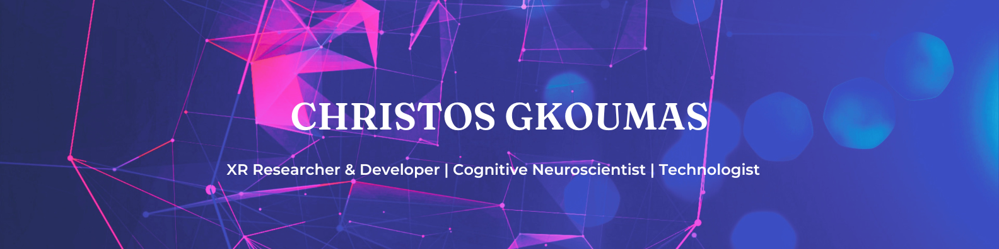

 

## Hello there, I'm Christos! 👋

### 👨‍💻 About Me:
I am an Experimental Psychology PhD candidate and a self-taught programmer. I study how people learn and remember information in naturalistic environments employing different methodological tools, such as `virtual reality`, `eye tracking`, and `computerized cognitive tasks`. I am passionate about things that lie at the intersection of psychology and technology, ranging from how people interact with technology to how we could use technology to assess and improve perception, cognition & health.   

### 💻 Tech Stack:
                       
  

### 💫 What's in here?  
Below you can find some of my personal/professional projects that might be of interest to you:

:point_right: [**Here**](https://github.com/n3urovirtual/ML_Beginner_Course) is a course I created for beginners to get started with Machine Learning using Python.

:point_right: [**Here**](https://github.com/n3urovirtual/child_ANT) is a computerized cognitive task I designed using PsychoPy that measures the efficiency of the three attention networks + a Python script to analyze the behavioral data.

:point_right: [**Here**](https://github.com/n3urovirtual/Edge_Detection_Application) is a web application I created that performs edge detection in user-provided images.

:point_right: [**Here**](https://github.com/n3urovirtual/Tap-and-Play) is a tablet serious game I developed using Unity that promotes goal-directed behavior for children with cortical visual impairment.

:point_right: [**Here**](https://github.com/n3urovirtual/Incise) is a proof of concept I developed using Unity that combines aiming with cognitive training.
  

### 🌐 Connect with me:
 
  * If you are interested in my profile or have any questions/feedback, do not hesitate to [reach out to me](mailto:chrgkoumas@gmail.com)!

<!--
**n3urovirtual/n3urovirtual** is a ✨ _special_ ✨ repository because its `README.md` (this file) appears on your GitHub profile.

Here are some ideas to get you started:

- 🔭 I’m currently working on ...
- 🌱 I’m currently learning ...
- 👯 I’m looking to collaborate on ...
- 🤔 I’m looking for help with ...
- 💬 Ask me about ...
- 📫 How to reach me: ...
- 😄 Pronouns: ...
- ⚡ Fun fact: ...
-->
